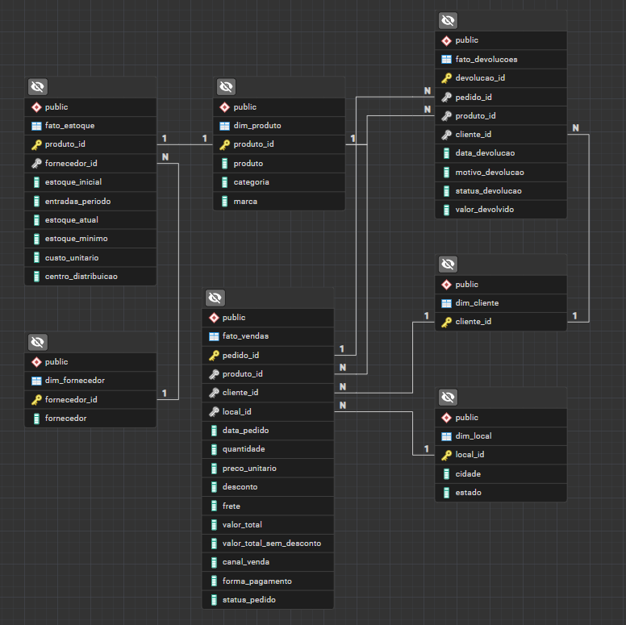
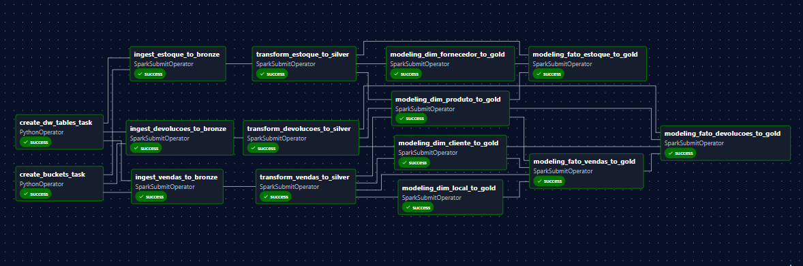

# E-Commerce Data Pipeline (Medallion Architecture)

Este repositório contém um pipeline de engenharia de dados ponta a ponta projetado para simular um cenário real de e-commerce. O objetivo principal é ingerir dados diários de arquivos CSV, processá-los utilizando a arquitetura medalhão em um Data Lake (MinIO) e disponibilizar a camada analítica estruturada (fatos e dimensões) tanto no próprio Data Lake (MinIO) quanto em um Data Warehouse (PostgreSQL) para consumo de inteligência de negócios.

---

## 1. Objetivo do Projeto
O projeto demonstra a implementação de um fluxo de dados robusto, orquestrado e estruturado em camadas.

* **Cenário:** Uma plataforma de e-commerce gera arquivos diários CSV (vendas, devoluções, estoques). Estes arquivos apresentam problemas comuns de qualidade (inconsistências de formatos, registros duplicados, valores nulos). Para responder a perguntas estratégicas de negócio (como faturamento real descontando devoluções e reposição de estoque por fornecedor), a empresa necessita de uma solução automatizada que centralize, limpe, deduplique e estruture essas informações de maneira analítica e auditável.
* **Solução:** Um pipeline automatizado que ingere os arquivos brutos salvando-os na camada **Bronze** (Raw) do Data Lake, limpa e padroniza os dados na camada **Silver** (Cleaned), e carrega os dados modelados (Fatos e Dimensões) na camada **Gold** (Analytical) no Data Lake (MinIO) e no Data Warehouse (PostgreSQL).
* **Objetivos Técnicos e de Negócio**:
  * **Organização em Camadas e Rastreabilidade**: Garantir o armazenamento segregado e a rastreabilidade histórica completa dos dados, permitindo auditar a origem e o ciclo de transformações de cada registro.
  * **Consumo**: Disponibilizar dados limpos e modelados em tabelas de Fatos e Dimensões prontos para serem consumidos ferramentas analíticas. Para este projeto, o Power BI é utilizado para a criação de dashboards interativos e analíticos.

---

## 2. Arquitetura de Dados (Camada Medalhão com Data Lake e Data Warehouse)
A arquitetura medalhão é híbrida, utilizando armazenamento em Object Storage e Banco de Dados Relacional:

* **Camada `bronze` (Raw - Lake):** Armazenada no **MinIO** (Object Storage). Ingesta os dados convertendo os CSVs brutos em arquivos no formato **Parquet**, estruturando os dados na sua forma original com histórico de carga. A ingestão é incremental, utilizando lógica de CDC (Change Data Capture) com checagem de IDs para garantir que apenas dados novos sejam adicionados caso ainda restem duplicados após a filtragem de CDC.
* **Camada `silver` (Cleaned - Lake):** Armazenada no **MinIO** (Object Storage) também em formato **Parquet**. Contém dados limpos e padronizados com histórico de carga. A transformação é realizada de forma incremental utilizando a lógica da coluna `data_carga` para processar apenas novas cargas, realizando a checagem de IDs para garantir a inserção exclusiva de dados novos.
* **Camada `gold` (Analytical - Lake & DW):** Armazenada em formato **Parquet** no **MinIO** (Object Storage) e carregada no **PostgreSQL** (Data Warehouse). Estruturada em tabelas dimensionais (Fatos e Dimensões usando Star Schema) otimizadas para consultas rápidas e consumo pelo Power BI.

### 2.1. Tabelas das Camadas Silver e Gold
* **Camada Silver:**
  * `vendas`: Dados transacionais de vendas.
  * `devolucoes`: Dados transacionais de devoluções.
  * `estoque`: Níveis de estoque.
* **Camada Gold (Star Schema):**
  * **Dimensões:**
    * `dim_produto`: Cadastro de produtos, categorias e marcas.
    * `dim_cliente`: Cadastro de clientes.
    * `dim_local`: Cadastro de cidades e estados.
    * `dim_fornecedor`: Cadastro de fornecedores.
  * **Fatos:**
    * `fato_vendas`: Dados transacionais de vendas.
    * `fato_devolucoes`: Dados transacionais de devoluções.
    * `fato_estoque`: Níveis de estoque.

#### Diagrama de Entidade-Relacionamento (ERD)


---

## 3. Fluxo da DAG e Dependências
O fluxo segue a seguinte hierarquia e dependência de execução das tarefas no Apache Airflow:

a. **Setup Inicial**:
   * `create_buckets_task`: Responsável por garantir que os buckets do MinIO existam.

b. **Ingestão e Transformação (Bronze ➔ Silver)**:
   * *Nota: As tarefas de ingestão iniciam em paralelo após a conclusão do setup inicial.*
   * `ingest_vendas_to_bronze` → `transform_vendas_to_silver`
   * `ingest_estoque_to_bronze` → `transform_estoque_to_silver`
   * `ingest_devolucoes_to_bronze` → `transform_devolucoes_to_silver`

c. **Modelagem Analítica (Gold)**:
   * **Dimensões**:
     * `modeling_dim_produto_to_gold`: Executa após a conclusão de `transform_vendas`, `transform_estoque` e `transform_devolucoes`.
     * `modeling_dim_cliente_to_gold`: Executa após a conclusão de `transform_vendas` e `transform_devolucoes`.
     * `modeling_dim_local_to_gold`: Executa após a conclusão de `transform_vendas`.
     * `modeling_dim_fornecedor_to_gold`: Executa após a conclusão de `transform_estoque`.
   * **Fatos**:
     * `modeling_fato_vendas_to_gold`: Depende de `transform_vendas` e das dimensões `modeling_dim_local_to_gold`, `modeling_dim_produto_to_gold` e `modeling_dim_cliente_to_gold`.
     * `modeling_fato_devolucoes_to_gold`: Depende de `transform_devolucoes`, do carregamento prévio de `modeling_fato_vendas_to_gold` e das dimensões `modeling_dim_produto_to_gold` e `modeling_dim_cliente_to_gold`.
     * `modeling_fato_estoque_to_gold`: Depende de `transform_estoque` e das dimensões `modeling_dim_fornecedor_to_gold` e `modeling_dim_produto_to_gold`.

#### Grafo de Dependências da DAG


---

## 4. Tecnologias Utilizadas
* **Linguagem Principal:** [Python 3.12](https://docs.python.org/3.12/)
* **Processamento de Dados:** [PySpark](https://spark.apache.org/docs/latest/api/python/index.html) (processamento massivo) e [Pandas](https://pandas.pydata.org/docs/) (análise exploratória rápida)
* **Banco de Dados / Data Warehouse:** [PostgreSQL 17](https://www.postgresql.org/docs/17/) (Instalado localmente no Host Windows)
* **Object Storage (Lake):** [MinIO](https://min.io/docs/minio/linux/index.html) (simulação de S3/Cloud Storage)
* **Orquestração:** [Apache Airflow](https://airflow.apache.org/docs/) (para agendamento e gerenciamento do pipeline)
* **Conteinerização:** [Docker](https://docs.docker.com/) e [Docker Compose](https://docs.docker.com/compose/) (isolamento do ambiente e dependências)
* **ORM e Conexão:** [SQLAlchemy](https://docs.sqlalchemy.org/en/20/)
* **Monitoramento e Logs:** [Loguru](https://loguru.readthedocs.io/)
* **Visualização:** [Power BI](https://learn.microsoft.com/power-bi/)

---

## 5. Origem dos Scripts e Imagens Docker
As imagens de infraestrutura utilizadas neste projeto foram obtidas diretamente de fontes oficiais:
* **Apache Airflow (Script Docker Compose Pronto para Uso):** O arquivo base `docker-compose.yaml` foi obtido a partir da documentação oficial do [Apache Airflow Docker Compose Quick Start](https://airflow.apache.org/docs/apache-airflow/stable/docker-compose.yaml).
* **Apache Spark:** Imagem Docker oficial [apache/spark:3.5.1](https://hub.docker.com/r/apache/spark) baixada do Docker Hub.
* **MinIO:** Imagem Docker oficial [quay.io/minio/minio](https://quay.io/repository/minio/minio) baixada do Quay.io.

---

## 6. Estrutura do Projeto e Pastas
```text
e-commerce_pipeline/
├── dags/                 # DAGs do Apache Airflow para orquestração
├── data/                 # Arquivos CSV diários recebidos
├── docker/               # Dockerfiles utilizados no projeto
├── docs/                 # Diagramas e documentação do projeto
├── notebooks/            # Jupyter Notebooks para análise exploratória e testes
└── src/                  # Código-fonte do pipeline
│   ├── config/           # Configurações globais e de banco de dados
│   ├── jobs/             # Jobs dos pipelines (bronze, silver e gold)
│   ├── modules/          # Módulos reutilizáveis (classes, transformações, loads)
│   ├── services/         # Serviços reutilizáveis (minio, postgres, spark)
│   └── sql/              # Scripts SQL para criação das tabelas
├── tests/                # Testes do pipeline
├── .env                  # Variáveis de ambiente (credenciais, paths)
├── .gitignore            # Arquivos ignorados pelo Git
├── docker-compose.yml    # Configuração do Docker Compose
├── README.md             # Documentação do projeto
└── requirements.txt      # Dependências de bibliotecas Python
```

---

## 7. Configurações e Dependências

### Pré-requisitos
* Git (para clonar o repositório)
* WSL2 (Windows Subsystem for Linux 2) habilitado (se estiver utilizando Windows)
* Docker e Docker Compose instalados e integrados com o WSL2 (para execução do pipeline)
* Python 3.12 (caso queira executar scripts isoladamente local)
* PostgreSQL Server 17 (Instalado no Host Windows)
* Power BI Desktop (para visualização dos dashboards analíticos)

### Variáveis de Ambiente
Crie um arquivo `.env` na raiz do projeto com base no modelo abaixo:
```env
AIRFLOW_UID= # UID do usuário do sistema operacional (use o comando 'id -u')

MINIO_ROOT_USER= # Usuário administrador do MinIO (padrão: minioadmin)
MINIO_ROOT_PASSWORD= # Senha do administrador do MinIO (padrão: minioadmin)
MINIO_ENDPOINT= # Endpoint do MinIO para conexões internas (padrão: http://minio:9000)

SPARK_MASTER= # URL do Spark Master (padrão: spark://spark-master:7077)

PG_USER= # Usuário do PostgreSQL DW (ex: postgres ou seu_usuario)
PG_PASSWORD= # Senha do usuário do PostgreSQL DW
PG_HOST= # IP do host Windows para conexões do WSL (ex: 172.25.64.1)
PG_PORT= # Porta de escuta do PostgreSQL (padrão: 5432)
PG_DB= # Nome do banco de dados (ex: db_ecommerce)
```

### Configuração do PostgreSQL no Host Windows (Data Warehouse)
Como a infraestrutura do projeto opera em containers, é necessário configurar o PostgreSQL instalado na máquina local do host Windows a autorizar requisições das sub-redes Docker e, se usado, WSL2:

a. Modifique o arquivo `pg_hba.conf` do PostgreSQL Server no Windows inserindo os direcionamentos IP:
```conf
# Acesso interno para serviços Docker e WSL2
host    all    		all    		172.16.0.0/12     	md5
```

b. Crie uma regra explícita no **Firewall do Windows** permitindo tráfego de entrada na porta de conexão de entrada TCP do PostgreSQL (`5432`).

#### Criação do Banco e Permissões de Esquema
Como a aplicação opera sob o princípio de mínimo privilégio, é necessário criar previamente o usuário de conexão configurado no `.env` e seu respectivo escopo.

Acesse o PostgreSQL do host Windows como superusuário (geralmente `postgres`) e execute sequencialmente:
```sql
-- Crie o usuário no Postgres apenas se necessário
CREATE USER seu_usuario_postgres WITH PASSWORD 'sua_senha_postgres';

-- Crie o banco de dados apenas se necessário
CREATE DATABASE seu_banco_de_dados OWNER seu_usuario_postgres;

-- Após conectar-se ao banco (seu_banco_de_dados), libere os privilégios gerais:
GRANT ALL ON SCHEMA public TO seu_usuario_postgres;
```

---

## 8. Como Executar

### a. Clonar o Repositório
```bash
git clone https://github.com/seu-usuario/e-commerce_pipeline.git
cd e-commerce_pipeline
```

### b. Iniciar a Infraestrutura (Docker)
Suba os containers do MinIO, Spark, Jupyter e Apache Airflow:
```bash
docker-compose up -d
```

---

## 9. Interfaces Web do Ambiente (Portas e Acessos)
Durante o desenvolvimento ou execução, as seguintes ferramentas podem ser acessadas pelo navegador local:

| Ferramenta | Descrição | Endereço Local | Credenciais Padrão |
| :--- | :--- | :--- | :--- |
| **Apache Airflow** | Orquestração de workflows e logs | `http://localhost:8080` | `airflow` / `airflow` |
| **MinIO Console** | Navegação nos arquivos Parquet do Lake | `http://localhost:9001` | `minioadmin` / `minioadmin` |
| **Spark Master UI** | Monitoramento de recursos do cluster e jobs | `http://localhost:8081` | - |
| **Jupyter Server** | Desenvolvimento e execução de notebooks | `http://localhost:8888` | - |

---

## 10. Desenvolvimento Interativo com Jupyter Notebooks
O diretório `notebooks/` contém notebooks voltados para análise exploratória de dados, testes de transformações e prototipação das dimensões e fatos:
* **Uso Geral**: Os notebooks lêem dados do MinIO (Bronze ou Silver), aplicam a lógica de processamento/modelagem e exibem os dados de forma legível por meio do método `display(df.limit(5).toPandas())`.
* **Segurança e Isolamento**: Os notebooks **não persistem** dados de volta ao lake (camada Gold); a gravação e partição de dados é de responsabilidade exclusiva dos scripts de produção (`src/jobs/`).

---

## 11. Melhorias Futuras
* **Data Lake na Nuvem:** Substituir o armazenamento local por armazenamento em nuvem: AWS S3 (Amazon Web Services Simple Storage Service), ADLS Gen2 (Azure Data Lake Storage Gen2) ou GCS (Google Cloud Storage).
* **CI/CD Pipeline:** Configurar GitHub Actions para rodar testes automatizados (`pytest`).
